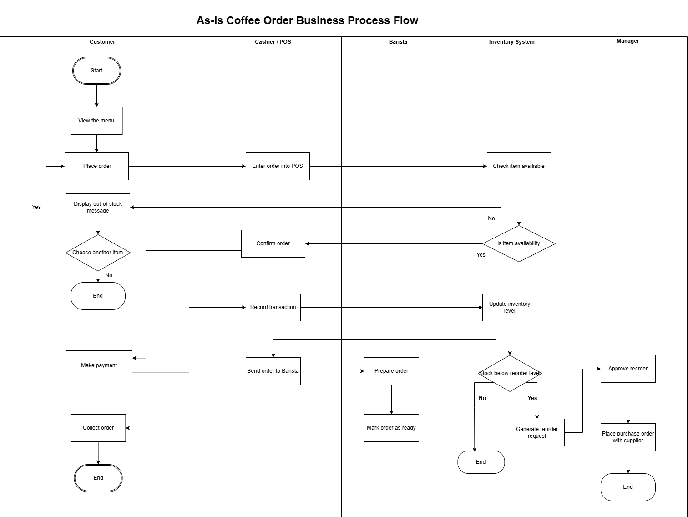
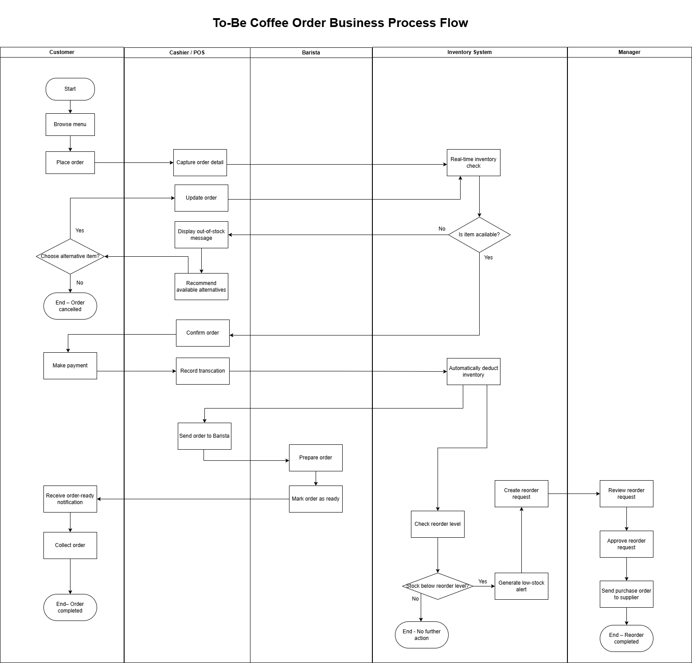
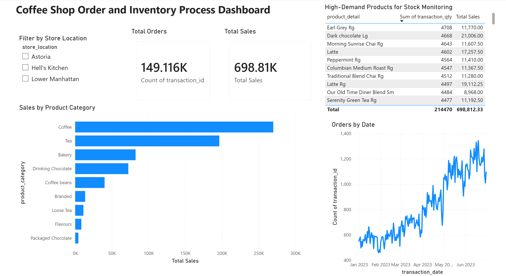

# Coffee Shop Order Process Optimization

## Project Overview
This project demonstrates how business process modelling and dashboard analytics can be combined to improve a small coffee shop’s order and inventory workflow. The project includes an As-Is process analysis, a redesigned To-Be process, process comparison, KPI impact analysis, and a Power BI dashboard for operational decision support.

## As-Is: Current Process Flow

**Key Issues Identified:**
- Inventory checks occur too late in the process (after order entry), leading to stockouts and poor customer experience.
- Manual order taking and confirmation increase the risk of errors.
- Reorder process is heavily manual and depends on manager approval, creating bottlenecks.
- Limited handling for out-of-stock situations and payment failures.

## To-Be: Proposed Improved Process

## Process Comparison

This section compares the original As-Is process with the improved To-Be process to demonstrate how the redesigned workflow improves efficiency, accuracy, and inventory visibility.

See the full comparison here: [Process Comparison](process-comparison.md)

## Business Impact and KPI Analysis

This section explains the expected business impact of the redesigned To-Be process and identifies KPIs that could be used to evaluate the improvement.

See the full analysis here: [Business Impact and KPI Analysis](business-impact.md)

**Key Improvements:**
- Real-time inventory check before order confirmation to prevent stockouts.
- Automatic low-stock alerts and reorder requests.
- Customer receives ready notification via app.
- Reduced manual steps and manager approval.

## Power BI Dashboard

A Power BI dashboard was created to support the redesigned To-Be process by visualising order volume, sales performance, product demand, and potential inventory pressure.

The dashboard is interactive in Power BI and includes store-location filtering, daily order trend analysis, product category sales comparison, and high-demand product monitoring.

The dashboard includes:
- Total orders and total sales
- Sales by product category
- Daily order trends
- High-demand products requiring stock monitoring
- Store location filtering

## Tools Used

- Draw.io (diagrams.net) – for creating professional swimlane flowcharts.
- Power BI – for building an interactive dashboard to visualise order volume, sales performance, product demand, and inventory monitoring needs.
- GitHub – for documenting the project and presenting it as a portfolio case study.
- Markdown – for writing structured project documentation.

## Learning Outcomes
- Developed skills in business process analysis and modeling.
- Learned to identify bottlenecks in real-world operations and propose IT-based solutions.
- Gained experience documenting processes for stakeholders.

## Future Enhancements

- Extend the Power BI dashboard by adding simulated inventory levels, low-stock alerts, and reorder trend analysis.
- Add additional exception handling scenarios, such as payment failure, customer order cancellation, and supplier delay.
- Create a simple data model showing how POS, inventory, and reorder data could be connected.
- Develop a more detailed supplier replenishment process, including purchase order approval and supplier delivery tracking.
